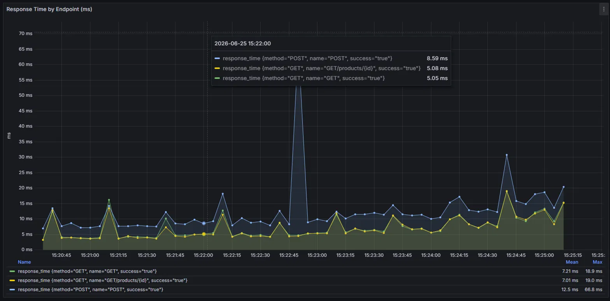
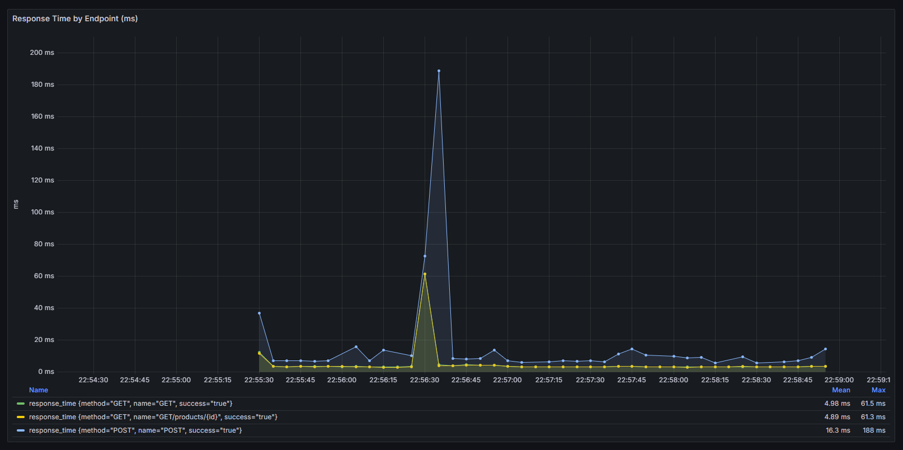

### Стенд для нагрузочного тестирования

Полноценный стенд для нагрузочного тестирования, демонстрирующий как смоделировать реалистичный трафик, измерить поведение сервиса под нагрузкой и наблюдать за ним в реальном времени. Проводится тестирование **настоящего сервиса на FastAPI с базой PostgreSQL** и пулом соединений — поэтому метрики отражают реальное поведение системы (стоимость чтения против записи, конкуренция за пул, точка деградации).

### Архитектура

```
GitHub / CLI ──> Locust ──HTTP──> FastAPI ──пул──> PostgreSQL
                   │
                   └──метрики──> InfluxDB ──> Grafana (live-дашборд)
```

- **FastAPI + PostgreSQL** — тестируемый сервис: интернет-магазин (товары / пользователи / заказы) с реальным пулом соединений, который и определяет поведение под нагрузкой.
- **Locust** — генератор нагрузки. Сценарии на Python с реалистичными весами задач (много просмотров, мало покупок) и два профиля нагрузки.
- **InfluxDB** — time-series хранилище метрик, куда пишет кастомный listener.
- **Grafana** — live-дашборд, читает из InfluxDB; время ответа по каждому endpoint в реальном времени.

### Стек

`Locust` · `FastAPI` · `PostgreSQL` · `SQLAlchemy` · `Pydantic` · `InfluxDB 2.x` · `Grafana` · `Docker Compose`

### Быстрый старт

```bash
git clone https://github.com/jbly312/load_testing_stand.git
cd load_testing_stand

cp .env.example .env       # заполнить значения (или взять дефолтные)

docker-compose up --build
```
### Дефолтные значения


```
# PostgreSQL
POSTGRES_USER=shop
POSTGRES_PASSWORD=shop
POSTGRES_DB=shopdb

# InfluxDB
INFLUXDB_USERNAME=admin
INFLUXDB_PASSWORD=admin12345
INFLUXDB_ORG=loadtest
INFLUXDB_BUCKET=locust
INFLUXDB_TOKEN=my-super-secret-token

# Grafana
GRAFANA_USER=admin
GRAFANA_PASSWORD=admin
```
Затем открыть:

| Сервис         | URL                     |
|----------------|-------------------------|
| Locust UI      | http://localhost:8089   |
| Grafana        | http://localhost:3000   |
| Backend (API)  | http://localhost:8000   |

В Locust нажать **Start** — активный профиль нагрузки управляет тестом сам. Метрики идут в дашборд Grafana вживую.

### Профили нагрузки

Два профиля демонстрируют разные типы тестов. Активный переключается в `load_tests/locustfile.py`.

**Step load (stress-тест)** — нагрузка растёт ступенями до потолка. Ищет точку, где сервис начинает деградировать.



**Spike-тест** — нагрузка спокойна, затем резкий скачок, затем спад. Проверяет устойчивость к внезапным всплескам трафика и восстановление.



Трафик смоделирован с реалистичными весами — большинство пользователей листают каталог, немногие оформляют заказ:

```python
@task(10)  browse_catalog    # GET /products       — чаще всего
@task(6)   view_product      # GET /products/{id}
@task(1)   create_order      # POST /orders         — реже всего
```

### Что показали тесты

- **Стоимость чтения vs записи.** `GET`-запросы оставались быстрыми (~5 мс), а `POST` (запись в БД) стабильно медленнее — видно во всех прогонах. Запись дороже чтения.
- **Система масштабируется линейно под нормальной нагрузкой.** До нескольких сотен одновременных пользователей p95 оставался плоским, ошибок ноль — пул соединений справлялся.
- **Узкое место — пул соединений, а не приложение.** При запредельной нагрузке запросы начинали ждать свободное соединение. Когда очередь превысила 30-секундный таймаут пула — запросы стали падать. Точка отказа сервиса, найденная экспериментально.
- **Зачем нужны перцентили.** Медиана оставалась низкой даже под спайком, но p99 и max ловили «хвост» — невезучие запросы, дольше всех ждавшие слот в пуле. Среднее это скрывает, перцентили показывают.

### Структура проекта

```
load-testing-lab/
├── backend/                  Сервис FastAPI (мишень)
│   ├── main.py               endpoints
│   ├── database.py           пул соединений (узкое место)
│   ├── models.py             таблицы SQLAlchemy
│   ├── schemas.py            валидация Pydantic
│   └── seed.py               тестовые данные
├── load_tests/               Locust
│   ├── locustfile.py         точка входа
│   ├── base.py               базовый класс пользователя
│   ├── influx_listener.py    кастомная отправка метрик в InfluxDB
│   ├── tasks/                сценарии запросов с весами
│   └── shapes/               профили нагрузки (step_load, spike)
├── monitoring/
│   └── grafana/provisioning/ авто-настройка datasource + дашборд
├── docker-compose.yml        весь стек: 5 сервисов
└── .env.example              шаблон секретов
```

### Примечания

- Дашборд Grafana настраивается автоматически — появляется при старте без ручной настройки, что делает весь стек воспроизводимым на любой машине.
